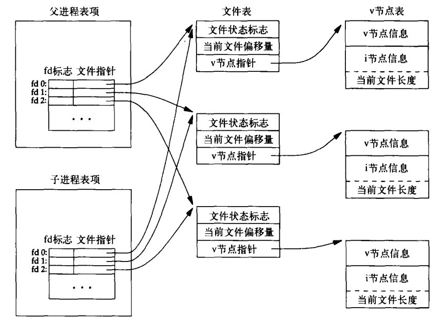
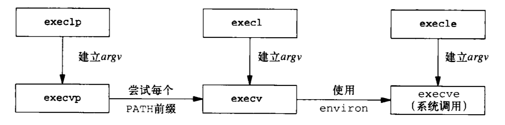

# Advanced Programming in the UNIX Environment—Chapter 08 进程控制

## 1. 进程标识符

### 1.1 性质

+ 非负性
+ 唯一性
+ 可重用性：一个进程终止后，其进程ID可以再次使用

### 1.2 专用进程

#### 1.2.1 调度进程（交换进程）

+ ID通常为**0**
+ 内核一部分，不执行任何磁盘上的程序，系统进程

#### 1.2.2 `init`进程

+ ID通常为**1**
+ 自举过程结束后内核调用

#### 1.2.3 页守护进程

+ ID通常为**2**
+ 支持虚拟存储器的分页操作

### 1.3 相关函数

```C
#include <unistd.h>

// 返回调用进程的进程ID
pid_t getpid(void);

// 返回调用进程的父进程ID
pid_t getppid(void);

// 返回调用进程的实际用户ID
uid_t getuid(void);

// 返回调用进程的有效用户ID
uid_t geteuid(void);

// 返回调用进程的实际组ID
gid_t getgid(void);

// 返回调用进程的有效组ID
gid_t getegid(void);
```

## 2. `fork`函数

### 2.1 功能

创建子进程

### 2.2 函数原型

```C
#include <unistd.h>

pid_t fork(void);
```

### 2.3 返回值

+ 未出现错误
    + 父进程中，`fork`的返回值是创建的子进程的进程ID*（因为一个进程的子进程可以有多个，并且没有函数可以获得其所有子进程的进程ID）*
    + 子进程中，`fork`的返回值是0*（一个进程只会有一个父进程， 子进程可以调用`getppid`获得父进程的进程ID）*
+ 出现错误：返回-1

### 2.4 函数效果

+ 子进程和父进程继续执行`fork`调用后的指令，子进程获得父进程数据空间、堆和栈的**副本*（并不共享）***，但是父子进程**共享正文段**
+ `fork`之后父子进程执行顺序不定

### 2.5 文件共享

`fork`的特性是父进程的所有打开文件描述符都被复制到子进程中



### 2.6 函数失败原因

+ 系统进程太多
+ 实际用户ID的进程总数超出系统限制

### 2.7 两种用法

+ 父进程复制自己，使得父子进程同时执行不同代码段。例如网络服务进程中，父进程等待客户端服务请求，请求到达时父进程调用`fork`，使子进程处理此请求，父进程继续等待下一个服务请求到达
+ 一个进程要执行不同的程序*（在shell中很常见）*，这种情况下，子进程从`fork`返回后立即调用`exec`

## 3. `vfork`函数

### 3.1 功能

创建子进程

### 3.2 函数原型

```C
#include <unistd.h>

pid_t vfork(void);
```

### 3.3 `vfork`和`fork`的区别

+ `vfork`调用后保证子进程先执行
+ 并不将父进程的地址空间完全复制到子进程中*（因为子进程会立即调用`exec`或`exit`，于是也就不会访问该地址空间）*

## 4. `wait`和`waitpid`函数

### 4.1 功能

等待子进程结束

### 4.2 函数原型

```C
#include <sys/wait.h>

// 成功返回进程ID或0，出错返回-1
pid_t wait(int *status);
pid_t waitpid(pid_t pid, int *status, int options);
```

### 4.3 参数`status`

+ 非空指针：保存子进程退出状态
+ 空指针：不关注子进程如何结束

### 4.4 检查`wait`和`waitpid`所返回的终止状态的宏

|           宏           |                             说明                             |
| :--------------------: | :----------------------------------------------------------: |
|  `WIFEXITED(status)`   |             若为正常终止子进程返回的状态，则为真             |
| `WIFSIGNALED(status)`  |             若为异常终止子进程返回的状态，则为真             |
|  `WIFSTOPPED(status)`  |             若为当前暂停子进程返回的状态，则为真             |
| `WIFCONTINUED(status)` | 若为作业控制暂停后已经继续的子进程返回的状态，则为真*（仅用于`waitpid`）* |

### 4.5 参数`pid`

|    参数     |                 作用                 |
| :---------: | :----------------------------------: |
| `pid == -1` |   等待任一子进程*（等效于`wait`）*   |
|  `pid > 0`  |    等待进程ID与`pid`相等的子进程     |
| `pid == 0`  | 等待组ID等于调用进程组ID的任一子进程 |
| `pid < -1`  | 等待组ID等于`pid`绝对值的任一子进程  |

### 4.6 参数`options`

|     常量     |                             说明                             |
| :----------: | :----------------------------------------------------------: |
| `WCONTINUED` | 如果一个已经停止的子进程已经接收到了`SIGCONT`信号并继续运行，则`waitpid`会返回子进程的状态 |
|  `WNOHANG`   |                        非阻塞，返回0                         |
| `WUNTRACED`  | 如果子进程已经停止，并且这个子进程还没有被报告，则`waitpid`会返回子进程的状态 |

### 4.7 `waitpid`相较于`wait`独有的功能

+ `waitpid`可等待一个特定的进程
+ `waitpid`提供了一个`wait`的非阻塞版本*（设置`options`参数）*
+ `waitpid`支持作业控制

## 5. `waitid`函数

### 5.1 功能

获取进程终止状态

### 5.2 函数原型

```C
#include <sys/wait.h>

// 成功返回0，出错返回-1
int waitid(idtype_t idtype, id_t id, siginfo_t *infop, int options);
```

### 5.3 参数`idtype`

|   常量   |                             说明                             |
| :------: | :----------------------------------------------------------: |
| `P_PID`  |        等待一个特定进程：`id`包含要等待子进程的进程ID        |
| `P_PGID` | 等待一个特定进程组中的任一子进程：`id`包含要等待子进程的进程组ID |
| `P_ALL`  |                   等待任一子进程，忽略`id`                   |

### 5.4 参数`infop`

```C
typedef struct
{
    int si_signo;          // 信号编号
    int si_code;           // 信号代码
    union sigval si_value; // 信号值
    int si_errno;          // 错误代码
    pid_t si_pid;          // 发送该信号的进程id
    uid_t si_uid;          // 发送该信号的用户id
    void *si_addr;         // 错误发生的地址
    int si_status;         // 子进程的状态
    int si_band;           // 波段事件
} siginfo_t;
```

### 5.5 参数`options`

表格中常量按位"或"

|     常量     |                             说明                             |
| :----------: | :----------------------------------------------------------: |
| `WCONTINUED` | 等待一个进程，它以前曾被暂停，此后又已继续，但其状态尚未报告 |
|  `WEXITED`   |                       等待已退出的进程                       |
|  `WNOHANG`   |          如无可用的子进程退出状态，立即返回而非阻塞          |
|  `WNOWAIT`   | 不破坏子进程退出状态。该子进程退出状态可由后续的`wait`、`waitid`或`waitpid`调用取得 |
|  `WSTOPPED`  |          等待一个进程，它已经暂停，但其状态尚未报告          |

## 6. `wait3`和`wait4`函数

### 6.1 功能

获取子进程状态信息，同时可以获取子进程的资源使用信息

### 6.2 函数原型

```C
#include <sys/types.h>
#include <sys/wait.h>
#include <sys/time.h>
#include <sys/rcesoure.h>

// 成功返回进程ID，出错返回-1
pid_t wait3(int *status, int options, struct rusage *rusage);
pid_t wait4(pid_t pid, int *status, int options, struct rusage *rusage);
```

### 6.3 参数`rusage`

用于返回子进程的资源使用情况

### 6.4 参数`pid`

同`waitpid`函数

### 6.5 参数`options`

同`waitpid`函数

### 6.6 区别

+ `wait3`函数等待所有的进程
+ `wait4`函数可以像`waitpid`一样指定要等待的子进程

## 7. 竞争条件

### 7.1 概念

当多个进程试图处理共享数据时，其最终结果依赖于各个进程的运行顺序，这种情况被称为竞争条件

### 7.2 对策

+ 信号机制
+ 进程间通信（IPC）

## 8. `exec`函数

### 8.1 功能

在当前进程中加载并运行新的程序，会替换当前进程的映像、数据和堆栈等信息为新程序的映像、数据和堆栈

### 8.2 函数原型

```C
#include <unistd.h>

// 成功不返回值，出错返回-1
int execl(const char *pathname, const char *arg0, ... /* (char *)0 */);
int execv(const char *pathname, char *const argv[]);
int execle(const char *pathname, const char *arg0, ... /* (char *)0, char* const envp[] */);
int execve(const char *pathname, char *const argv[], char *const envp[]);
int execlp(const char *filename, const char *arg0, ... /* (char *)0 */);
int execvp(const char *filename, char *const argv[]);
```

### 8.3 函数名中字母的含义

+ `l`：代表"list"，它是一个参数地址列表，列表以空指针结尾
+ `v`：代表"vector"，它是一个存有各参数地址的指针数组的地址
+ `p`：代表"path"，它按照`PATH`环境变量指定的目录来搜索可执行文件
+ `e`：代表"environment"，它是一个存有环境变量字符串地址的指针数组的地址

### 8.4 参数`filename`

+ 若`filename`包含`/`，则将其视为路径名
+ 否则按照`PATH`环境变量搜寻可执行文件

### 8.5 六函数之间关系



### 8.6 注意

`exec`函数执行前后

+ 实际用户ID和实际组ID保持不变
+ 有效用户ID和有效组ID是否改变，取决于执行程序的`setuid`和`setgid`位

## 9. 更改用户ID和组ID

### 9.1 `setuid`和`setgid`函数

#### 9.1.1 功能

设置进程的用户ID和组ID

#### 9.1.2 函数原型

```C
#include <unistd.h>

// 成功返回0，出错返回-1
int setuid(uid_t uid);
int setgid(gid_t gid);
```

### 9.2 `setreuid`和`setregid`函数

#### 9.2.1 功能

设置进程的实际用户ID和实际组ID

#### 9.2.2 函数原型

```C
#include <unistd.h>

// 成功返回0，出错返回-1
int setreuid(uid_t uid);
int setregid(gid_t gid);
```

### 9.3 `seteuid`和`setegid`函数

#### 9.3.1 功能

设置进程的有效用户ID和有效组ID

#### 9.3.2 函数原型

```C
#include <unistd.h>

// 成功返回0，出错返回-1
int seteuid(uid_t uid);
int setegid(gid_t gid);
```

## 10. 解释器文件

起始行：

```shell
#! pathname [optional-argument]
```

感叹号和`pathname`之间的空格是**可选**的

`pathname`通常是绝对路径名，不进行特殊处理（即不使用`PATH`进行路径搜索）

## 11. `system`函数

### 11.1 功能

调用操作系统命令

### 11.2 函数原型

```C
#include <stdlib.h>

int system(const char *cmdstring);
```

### 11.3 参数`cmdstring`

若为`NULL`，则仅当命令处理程序可用时，`system`返回非0值（可用来测试一个操作系统是否支持`system`函数）

### 11.4 返回值

`system`函数通过调用`fork`、`exec`和`waitpid`实现，其返回值有三种情况：

+ 若`fork`失败或`waitpid`返回错误（非`EINTR`），`system`返回-1并设置`errno`
+ 若`exec`失败（即无法执行shell），返回值等同于执行`exit(127)`
+ 若三个函数均成功执行，返回shell的终止状态

## 12. 进程会计

## 13. 用户标识

### 13.1 `getlogin`函数

#### 13.1.1 功能

获取进程控制终端上登录的用户的名称

#### 13.1.2 函数原型

```C
#include <unistd.h>

// 成功返回指向登录名字符串的指针，出错返回NULL
char *getlogin(void);
```

## 14. 进程时间

### 14.1 `times`函数

#### 14.1.1 功能

获取进程时间

#### 14.1.2 `clock_t`类型

`clock_t`是一个长整型（`long`），表示系统的时钟嘀嗒数

将`clock_t`转换为秒，需要除以`CLOCKS_PER_SEC`或`sysconf(_SC_CLK_TCK)`

#### 14.1.3 `tms`结构体

```C
struct tms {
    clock_t tms_utime;  // 用户CPU时间
    clock_t tms_stime;  // 系统CPU时间
    clock_t tms_cutime; // 终止的子进程，用户CPU时间
    clock_t tms_cstime; // 终止的子进程，系统CPU时间
};
```

#### 14.1.4 函数原型

```C
#include <sys/times.h>

// 成功返回时钟嘀嗒数，出错返回-1
clock_t times(struct tms *buf);
```


