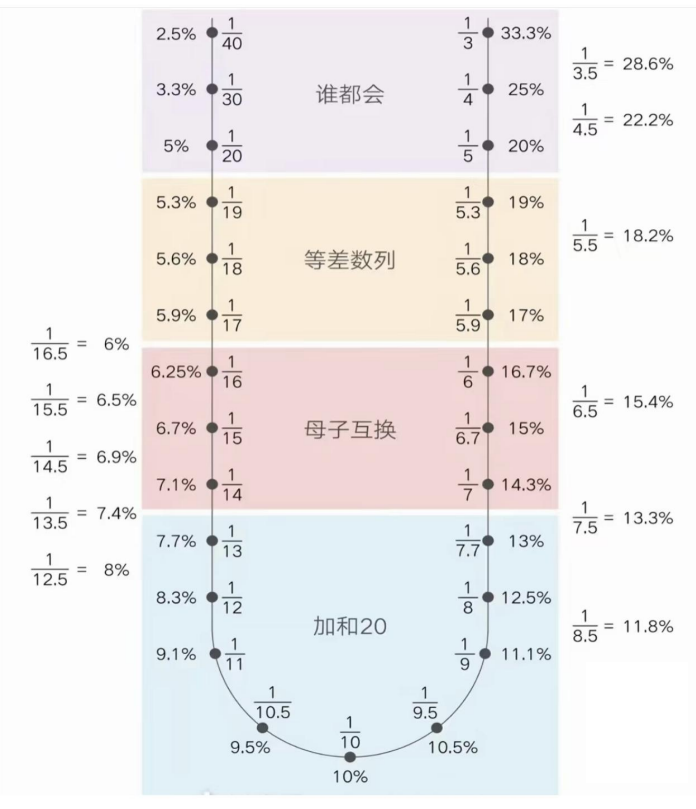

+ [资料分析](#资料分析)
  + [基期、增长量、增长率](#基期增长量增长率)
    + [基期](#基期)
    + [增长量](#增长量)
    + [增长率（增幅）](#增长率增幅)
    + [特殊增长率](#特殊增长率)
      + [名义/实际增长率](#名义实际增长率)
      + [间隔/乘积增长率](#间隔乘积增长率)
      + [年均增长率](#年均增长率)
  + [比重（均值）](#比重均值)
    + [基期比重（均值）](#基期比重均值)
    + [两期比重差](#两期比重差)
    + [均值增长率](#均值增长率)
  + [速算](#速算)
    + [百化分](#百化分)
    + [平方数](#平方数)
    + [高次幂](#高次幂)
    + [分数比较](#分数比较)
  + [综合分析策略](#综合分析策略)

# 资料分析

## 基期、增长量、增长率

### 基期

$$
B = \frac{C}{1+r}
$$

> [!TIP]
> 当 $|r| \leq 5\%$ 时， $\displaystyle \frac{C}{1+r} = \frac{C(1-r)}{(1+r)(1-r)} \approx C(1-r)$
> 
> 适用范围**不**包括：选项首位相同，第二位也相同，**且** $4\% \leq |r| \leq 5\%$

### 增长量

$$
\Delta = \frac{C}{1+r} \cdot r
$$

> [!IMPORTANT]
> $$
> \Delta = 
> \begin{cases}
> \displaystyle\frac{C}{\rho+1}, & r > 0 \\
> \displaystyle-\frac{C}{\rho-1}, & r < 0
> \end{cases}
> \quad \mathrm{where } |r| = \frac{1}{\rho}
> $$

> [!TIP]
> 当 $\boxed{r > 0}$ 时，比较增长量的法则：“**大大则大，一大一小看倍数**”
>
> 设基期分别为 $A$ 、 $B$ ，对应增长率为 $a > 0$ 、 $b > 0$ 
>
> + 若 $A a > B b$ ，则 $A$ 的增长量大于 $B$ 的增长量
> + 若 $A a \approx B b$，则在 **可用现期代替基期进行近似估计** 的情况下：
>   + 若 $\displaystyle \frac{A}{B} > \frac{b}{a}$，则 $A$ 的增长量大于 $B$
>
>   + 若 $\displaystyle \frac{A}{B} < \frac{b}{a}$，则 $B$ 的增长量大于 $A$
>
>   + 分式大的一方分子所代表的增长量大

### 增长率（增幅）

$$
r = \frac{\Delta}{B} = \frac{\Delta}{C - \Delta}
$$

> [!IMPORTANT]
> $\displaystyle \frac{\Delta}{C}$ 越大， $r$ 越大
> 
> $$
> r = \frac{1}{\frac{C}{\Delta}-1}
> $$

> [!TIP]
> 设：
>   + $X$ 月同比增长率为 $r_X$
>   + $Y(=X+1)$ 月同比增长率为 $r_Y$
> 
> 则：
>   + 若 $r_X < r_Y$：<u>环比增长率</u>**同比**上升
>   + 若 $r_X = r_Y$：<u>环比增长率</u>**同比**保持不变
>   + 若 $r_X > r_Y$：<u>环比增长率</u>**同比**下降

### 特殊增长率

#### 名义/实际增长率

$$
1 + r_n = (1 + r_r)(1 + \pi)
$$

其中：

+ $r_n$ ：名义增长率
+ $r_r$ ：实际增长率
+ $\pi$ ：通货膨胀率

> [!TIP]
> 设现期量为 $C$ ，则以不变价格计算的现期量应为
> $$
> C' = \frac{C}{1+r_n} \cdot (1+r_r)
> $$

> [!IMPORTANT]
> 拉动增长率 vs. 贡献率
> 
> $$
> r_{\mathrm{pull}} = \displaystyle \frac{\mathrm{部分增量}}{\mathrm{整体基期}}
> $$
> 
> $$
> r_{\mathrm{contri}} = \displaystyle \frac{\mathrm{部分增量}}{\mathrm{整体增量}}
> $$

#### 间隔/乘积增长率

$$
r_i = \frac{C}{B} -1 = \frac{B \cdot (1+r_1)(1+r_2)}{B} -1 = \boxed{ r_1 + r_2 + r_1 \cdot r_2 }
$$

+ $r_1, r_2$ ：相邻增长率

#### 年均增长率

$$
r_{\mathrm{avg}} = \sqrt[n]{\frac{C}{B}} - 1
$$

> [!IMPORTANT]
>
> + $n$ 年内某项指标的均值（不含“增长量”）：分母为 $n$
> + $n$ 年内某项指标的年均增长量或增长率：分母为 $n-1$
> 
> 例如：2012–2025年的工资均值分母为14，工资年均增长量/增长率分母为13

## 比重（均值）

### 基期比重（均值）

$$
\frac{A}{1+a} \div \frac{B}{1+b} = \boxed{ \frac{A}{B} \cdot \frac{1+b}{1+a} \underset{|r| \leq 10\%}{\approx} \frac{A}{B} \cdot (1+b-a)}
$$

> [!TIP]
> 当 $|r| \leq 10%$时：
> $$
> \frac{1+b}{1+a} = \frac{(1+b)(1-a)}{(1+a)(1-a)} = \frac{1+(b-a)-ab}{1-a^2} \approx 1 + (b-a)
> $$

### 两期比重差

$$
\frac{A}{B} - \frac{A}{B} \cdot \frac{1+b}{1+a} = \boxed{ \frac{A}{B} \cdot \frac{a-b}{1+a} }
$$

### 均值增长率

$$
\boxed{ r_\mathrm{avg} = \frac{a-b}{1+b} }
$$

> [!IMPORTANT]
> 两期比重差 vs. 均值增长率
> | 识别维度   | 两期比重差 (Change in Proportion) | 平均数增长率 (Growth Rate of Mean) |
> | :--------- | :-------------------------------- | :--------------------------------- |
> | 问题关键词 | “比重”、“占比” + 上升/下降        | “平均”、“单价”、“亩产” + 增长/下降 |
> | 结果单位   | ...个百分点                       | ...%                               |

## 速算

### 百化分

| 百分数 |             分数             | 百分数 |              分数              | 百分数 |             分数             |
| :----: | :--------------------------: | :----: | :----------------------------: | :----: | :--------------------------: |
| 16.7%  | $\displaystyle \frac{1}{6}$  | 15.4%  | $\displaystyle \frac{1}{6.5}$  |  5.6%  | $\displaystyle \frac{1}{18}$ |
| 14.3%  | $\displaystyle \frac{1}{7}$  | 13.3%  | $\displaystyle \frac{1}{7.5}$  |  5.3%  | $\displaystyle \frac{1}{19}$ |
| 12.5%  | $\displaystyle \frac{1}{8}$  | 11.8%  | $\displaystyle \frac{1}{8.5}$  |  4.8%  | $\displaystyle \frac{1}{21}$ |
| 11.1%  | $\displaystyle \frac{1}{9}$  | 10.5%  | $\displaystyle \frac{1}{9.5}$  |  4.5%  | $\displaystyle \frac{1}{22}$ |
|  9.1%  | $\displaystyle \frac{1}{11}$ |  8.7%  | $\displaystyle \frac{1}{11.5}$ |  4.3%  | $\displaystyle \frac{1}{23}$ |
|  8.3%  | $\displaystyle \frac{1}{12}$ |   8%   | $\displaystyle \frac{1}{12.5}$ |  4.2%  | $\displaystyle \frac{1}{24}$ |
|  7.7%  | $\displaystyle \frac{1}{13}$ |  7.4%  | $\displaystyle \frac{1}{13.5}$ |  3.8%  | $\displaystyle \frac{1}{26}$ |
|  7.1%  | $\displaystyle \frac{1}{14}$ |  6.9%  | $\displaystyle \frac{1}{14.5}$ |  3.7%  | $\displaystyle \frac{1}{27}$ |
|  6.7%  | $\displaystyle \frac{1}{15}$ |  6.5%  | $\displaystyle \frac{1}{15.5}$ |  3.6%  | $\displaystyle \frac{1}{28}$ |
| 6.25%  | $\displaystyle \frac{1}{16}$ |        |                                |  3.4%  | $\displaystyle \frac{1}{29}$ |
|  5.9%  | $\displaystyle \frac{1}{17}$ |        |                                |  3.3%  | $\displaystyle \frac{1}{30}$ |

### 平方数

|  $x$  | $x^2$ |
| :---: | :---: |
|  17   |  289  |
|  18   |  324  |
|  19   |  361  |

|  $x$  | $x^2$ |  $x$  | $x^2$ |
| :---: | :---: | :---: | :---: |
|  21   |  441  |  29   |  841  |
|  22   |  484  |  28   |  784  |
|  23   |  529  |  27   |  729  |
|  24   |  576  |  26   |  676  |

### 高次幂

|  $x$  | $x^3$ |
| :---: | :---: |
|  1.1  |  1.3  |
|  1.2  |  1.7  |
|  1.3  |  2.2  |
|  1.4  |  2.7  |

|  $x$  | $x^4$ |
| :---: | :---: |
|  1.1  |  1.5  |
|  1.2  |  2.1  |
|  1.3  |  2.9  |
|  1.4  |  3.8  |

### 分数比较

> [!TIP]
> 分子快，分子大的分数大
> 
> 分母快，分母大的分数小

## 综合分析策略

> [!TIP]
> 1. **分析性选项**：两期比例比较、混合增长率、当月与前几月均值比较
> 2. **表述**
>    + 易错：“均”“都”“同一个”“逐年上升/下降”“首超”
>    + 易对：“约”
> 3. **陷阱**
>    + “多几倍”
>    + 日均、月均（忘记除以天数）
>    + 单位
> 4. 由易到难：找数->加减->一步除法->增长量->增长率->基期/两期比例计算