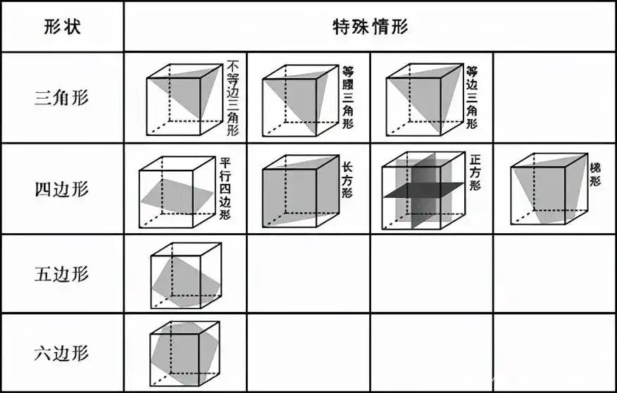
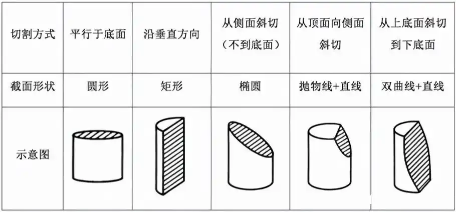
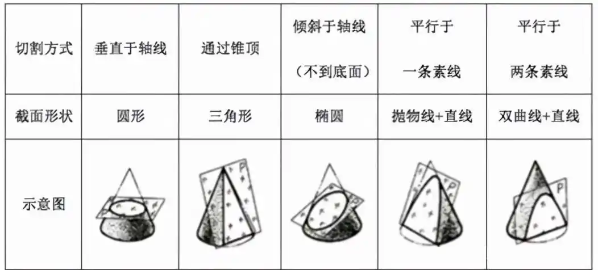

+ [数量关系](#数量关系)
  + [数论](#数论)
  + [几何](#几何)
  + [行程](#行程)
  + [集合](#集合)
  + [排列组合](#排列组合)
  + [概率](#概率)
  + [其他](#其他)

# 数量关系

## 数论

1. 勾股数组（至少有一个素数）

|   a   |   b   |   c   |
| :---: | :---: | :---: |
|   3   |   4   |   5   |
|   5   |  12   |  13   |
|   7   |  24   |  25   |
|   8   |  15   |  17   |
|   9   |  40   |  41   |
|  11   |  60   |  61   |

2. 整除规则
    + 能被4整除的数：末两位数能被4整除
    + 能被6整除的数：既能被2整除又能被3整除
    + 能被7整除的数：末三位数与除末三位数的数字组成的数之差能被7整除
    + 能被8整除的数：末三位数能被8整除
    + 能被9整除的数：各个数位上的数字和能被9整除
    + 能被11整除的数：奇数位上的数字和与偶数位上的数字和之差能被11整除

3. 等差数列

$$
a_n = a_1 + (n-1)d \\
$$

$$
\begin{align*}
S_n &= na_1+\frac{n(n-1)}{2} d \\ &= \frac{n(a_1+a_n)}{2}
\end{align*}
$$

## 几何

1. 平面上 $n$ 条直线

    + 最多交点数： $\displaystyle \frac{n(n-1)}{2}$

    + 将平面划分最多部分数： $\displaystyle \frac{n(n+1)}{{2}} + 1$

> [!TIP]
> 设 $n$ 条直线最多将平面划分为 $f(n)$ 个部分，显然 $f(1) = 2$  
> 当 $n > 1$ 时， $\displaystyle f(n) = f(n-1) + n = \frac{n(n+1)}{2} + 1$  
> $n = 1$也符合此式，故 $\displaystyle f(n) = \frac{n(n+1)}{{2}} + 1$

2. 三角形“四心”
    + **重心**：三角形三条中线的交点
        + 重心到顶点的距离是重心到对边中点距离的2倍
    + **垂心**：三角形三条高的交点
    + **外心**：三角形外接圆的圆心，三角形三边垂直平分线的交点
        + 外接圆半径 $\displaystyle R = \frac{abc}{4S}$ 
    + **内心**：三角形内切圆的圆心，三角形三条内角平分线的交点
        + 内切圆半径 $\displaystyle r = \frac{2S}{a+b+c}$

3. 侧面积
    + 圆锥： $S = \pi r l$
    + 圆台： $S = \pi (r_1 + r_2) l$

其中：
+ $l$ 是母线
+ $r_1$ 和 $r_2$ 是圆台的上、下底面半径
+ $r$ 是圆锥底面半径

4. 海伦公式

$$
S = \sqrt{p(p-a)(p-b)(p-c)}
$$

其中：

$$
p = \frac{a+b+c}{2}
$$

5. 截面

> [!TIP]
> 立方体截面中，三角形**只可能**为锐角三角形，五边形**不可能**为正五边形

## 行程

1. 多次相遇总路程
    + 两端出发： $S_n = (2n-1)S$
    + 同端出发： $S_n = 2nS$

其中：

+ $n$ 为相遇次数
+ $S$ 为两地距离
+ $S_n$ 为二者第 $n$ 次相遇所走过的路程和 

2. **等距**平均速度

$$
\bar{v} = \frac{2v_1 \cdot v_2}{v_1 + v_2} 
$$

## 集合

1. 三集合

$$
\begin{aligned}
|A \bigcup B \bigcup C| &= |A| + |B| + |C| - |A \bigcap B| - |A \bigcap C| - |B \bigcap C| + |A \bigcap B \bigcap C| \\
&= |A| + |B| + |C| - n_2 - 2n_3 \\
&= |A| + |B| + |C| - n_{\geq2} - n_3
\end{aligned}
$$

|    符号     |            含义             |
| :---------: | :-------------------------: |
|    $n_1$    | 恰好属于 1 个集合的元素个数 |
|    $n_2$    | 恰好属于 2 个集合的元素个数 |
|    $n_3$    | 恰好属于 3 个集合的元素个数 |
| $n_{\geq2}$ | 属于至少 2 个集合的元素个数 |

> [!TIP]
> $|A| + |B| + |C| = n_1 + 2n_2 + 3n_3$

2. 集合交集下界估计

$$
\left| \bigcap_{i=1}^k A_i \right| \ge \sum_{i=1}^k a_i - (k-1)|U|, \quad \text{where } |A_i| \ge a_i
$$

3. 设有 $n$ 个人，第 $i$ 个人独立完成的任务数分别为 $x_i$ ，第 $i$ 个人没有参与的任务数分别为 $A_i$ , 其中 $i \in \{ 1, 2, \cdots, n \}$ ，则：

$$
x_i = \frac{A_1 + A_2 + \cdots + A_n}{n-1} - A_i
$$

特别地，当 $n=3$时，

$$
x_1 = \frac{A_2 + A_3 - A_1}{2}
$$

> [!TIP]
> $$
> x_1 + x_2 + \cdots + x_n \triangleq N = (N - A_1) + (N - A_2) + \cdots (N - A_n) \\
\implies A_1 + A_2 + \cdots + A_n = (n-1)N \\
\implies x_i = N - A_i = \frac{A_1 + A_2 + \cdots + A_n}{n-1} - A_i
> $$

## 排列组合

1. 将 $M$ 个元素分为 $n$ 个组，每组大小为 $m_1, m_2, \dots, m_n$（可有重复）。设共有 $k$ 种不同的组大小，其中大小为 $s_j$ 的组出现 $r_j$ 次（$j = 1,2,\dots,k$），则：

| 情况                               | 公式                                                                                               |
| ---------------------------------- | -------------------------------------------------------------------------------------------------- |
| 组可区分（有标签，如A/B/C...）     | $\displaystyle \frac{M!}{m_1! \cdot m_2! \cdots m_n!}$                                             |
| 组不可区分（无标签，仅看成员集合） | $\displaystyle \frac{M!}{m_1! \cdot m_2! \cdots m_n!} \cdot \frac{1}{r_1! \cdot r_2! \cdots r_k!}$ |

> [!TIP]
>
> * 在可区分组情况下， $M!$ 为所有人的全排列，但组内顺序无关，因此需除以各组内部的全排列 $m_i!$
> * 在不可区分组情况下，大小相同的组还会造成重复，因此需额外除以 $\prod_{j=1}^k r_j!$

> [!NOTE]
> 12 人分为 5 个小组，大小分别为 3, 3, 2, 2, 2
> | 情况                          | 计算方式                                                                                            |
> | ----------------------------- | --------------------------------------------------------------------------------------------------- |
> | 组可区分 | $\displaystyle \frac{12!}{3! \times 3! \times 2! \times 2! \times 2!}$                              |
> | 组不可区分                    | $\displaystyle \frac{12!}{3! \times 3! \times 2! \times 2! \times 2!} \cdot \frac{1}{2! \times 3!}$ |

2. 隔板法： $n$ 个相同物体放入 $k$ 个不同盒子

| 情况         | 计算              |
| ------------ | ----------------- |
| 盒子不可为空 | $C_{n-1}^{k-1}$   |
| 盒子可为空   | $C_{n+k-1}^{k-1}$ |

3. 环排列问题： $n$ 个不同的元素进行环排列

| 情况       | 计算                                         |
| ---------- | -------------------------------------------- |
| 区分顺逆   | $(n-1)!$                                     |
| 不区分顺逆 | $\displaystyle \frac{(n-1)!}{2}, \, n\geq 2$ |

> [!TIP]
> 将 $n$ 个不同元素排成一列共有 $n!$ 种排列方式。而在环排列中，任意一个环可以通过旋转得到 $n$ 个等价的线性排列，因此每 $n$ 个线性排列对应同一个环排列，于是环排列的总数为 $\displaystyle \frac{n!}{n} = (n-1)!$

4. 错排数：将 $n$ 个元素重新排列，所有元素都没有出现在原来位置上

$$
D_n = nD_{n-1} + (-1)^n, \; n \geq 2
$$

|  $n$  | $D_n$ | $D_n^*$ |
| :---: | :---: | :-----: |
|   1   |   0   |    0    |
|   2   |   1   |    0    |
|   3   |   2   |    2    |
|   4   |   9   |    6    |
|   5   |  44   |   24    |

> [!TIP]
> $D_n$ 为错排数，$D_n^*$ 为错排且无交换对数

5. 爬楼梯模型（动态规划思想）

> [!NOTE]
> 某人爬楼梯，一次最多爬3级，爬10级楼梯有多少种爬法？  
> $dp[i] = dp[i-1] + dp[i-2] + dp[i-3], dp[0] = 1, dp[1] = 1, dp[2] = 2 \implies dp[10] = 274$  
> 注： $dp[0]$表示从地面到第0级台阶，有1种方法，即不动

## 概率

1. 条件概率

$$
P(B|A) + P(\bar{B}|A) = 1 \\
P(A \bar{B}) + P(AB) = P(A)
$$

2. ~~离散概率分布~~

| 分布类型   | $P(X = k)$                                              | $k \in$                                                             | $EX$                                |
| ---------- | ------------------------------------------------------- | ------------------------------------------------------------------- | ----------------------------------- |
| 超几何分布 | $\displaystyle \frac{C_M^k \cdot C_{N-M}^{n-k}}{C_N^n}$ | $\left[ \max \{0, n-(N-M) \}, \min\{n, M\} \right] \cap \mathbb{N}$ | $\displaystyle \frac{n \cdot M}{N}$ |
| 二项分布   | $C_n^k p^k (1-p)^{n-k}$                                 | $\{ 0, 1, 2, \cdots \}$                                             | $np$                                |
| 几何分布   | $(1-p)^{k-1} \cdot p$                                   | $\{ 1, 2, 3, \cdots \}$                                             | $\displaystyle \frac{1}{p}$         | $\displaystyle \frac{1}{p}$ |
| 0-1 分布   | $p^k (1-p)^{1-k}$                                       | $\{0, 1\}$                                                          | $p$                                 |

## 其他

1. 溶液问题的等比例修正

$$
\frac{A}{B} = \frac{C}{D} = \frac{A-C}{B-D}
$$

2. 对初始浓度为 $c_0$ 的溶液进行 $n$ 次操作。第 $i$ 次操作倒出溶液体积的比例为 $r_i$ ，然后加水补满至原体积。经过 $n$ 次操作后，最终浓度 $c_n$ 为：

$$
c_n = c_0 (1-r_1) (1-r_2) \cdots (1-r_n)
$$

3. $N$ 行 $N$ 列方阵
    + 最外圈元素数： $4N-4$
    + 圈数： $\displaystyle \left\lfloor \frac{N}{2} \right\rfloor$
    + 相邻两圈相差：8
    + 一行一列： $2N-1$

4. 空瓶换酒： $M$ 个空瓶可以换 $N$ 瓶酒，现有 $x$ 个空瓶，在**不赊账**的前提下能换多少瓶酒？其中 $M$ 、 $N$ 、 $x$ 都是正整数，且 $M > N$

$$
\left\lfloor \frac{x-N}{M - N} \right\rfloor \cdot N
$$

5. 钟表
    + 时针角速度：0.5°/min，分针角速度6°/min，二者角速度差为5.5°/min
    + 每天（24h）时针与分针重合22次，垂直44次

6. 天平称币问题：在使用天平称重的情况下，若称 $n$ 次，最多可以从 $3^n$ 张纸币中辨别出那一张是假币
