+ [图形推理](#图形推理)
  + [1. 考法](#1-考法)
    + [1.1 宫格图](#11-宫格图)
      + [1.1.1 九宫格](#111-九宫格)
      + [1.1.2 二十五宫格](#112-二十五宫格)
      + [1.1.3 网格折线](#113-网格折线)
    + [1.2 黑白图](#12-黑白图)
      + [1.2.1 蜂巢](#121-蜂巢)
      + [1.2.2 蜂巢圆阵](#122-蜂巢圆阵)
    + [1.3 复杂折线图](#13-复杂折线图)
    + [1.4 特殊元素](#14-特殊元素)
      + [1.4.1 圆](#141-圆)
      + [1.4.2 字母](#142-字母)
      + [1.4.3 汉字](#143-汉字)
      + [1.4.4 数字](#144-数字)
      + [1.4.5 其他字符](#145-其他字符)
      + [1.4.6 立体图形](#146-立体图形)
      + [1.4.7 七段数码管](#147-七段数码管)
  + [2. 位置规律](#2-位置规律)
    + [2.1 移动](#21-移动)
    + [2.2 旋转](#22-旋转)
    + [2.3 翻转](#23-翻转)
    + [2.4 互换](#24-互换)
    + [2.5 相邻比较](#25-相邻比较)
  + [3. 样式规律](#3-样式规律)
    + [3.1 黑白运算](#31-黑白运算)
    + [3.2 加减同异](#32-加减同异)
    + [3.3 遍历](#33-遍历)
  + [4. 属性规律](#4-属性规律)
    + [4.1 对称性](#41-对称性)
    + [4.2 曲直性](#42-曲直性)
    + [4.3 开闭性](#43-开闭性)
  + [5. 数量规律](#5-数量规律)
    + [5.1 堆/部分](#51-堆部分)
    + [5.2 素](#52-素)
    + [5.3 点](#53-点)
    + [5.4 线](#54-线)
    + [5.5 角](#55-角)
    + [5.6 面](#56-面)
    + [5.7 综合](#57-综合)
  + [6. 特殊规律](#6-特殊规律)
    + [6.1 图形间关系](#61-图形间关系)
    + [6.2 功能元素](#62-功能元素)

> [!TIP]
> + 元素组成相同：位置规律->样式规律->属性规律->数量规律（面->线）
> + 元素组成相似：样式规律
> + 元素组成不同：属性规律->数量规律

# 图形推理

## 1. 考法

### 1.1 宫格图

#### 1.1.1 九宫格

+ 优先看横行
+ “米”字形看[例](#shape_of_mi)

---

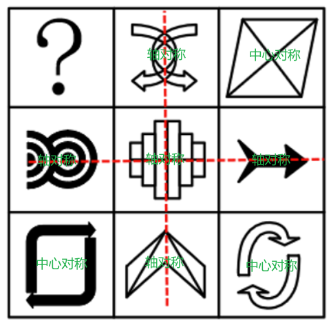

---

#### 1.1.2 二十五宫格

+ 内外分开[例](#25grids)

---

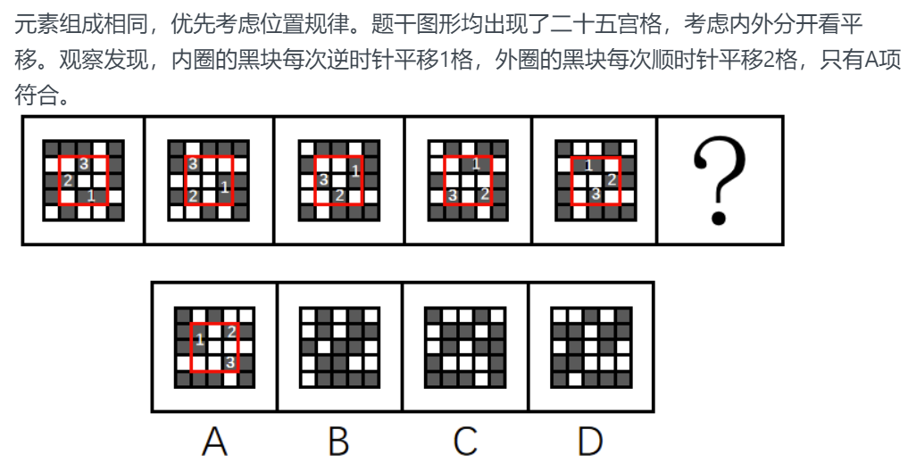

---

#### 1.1.3 网格折线

+ 经过的格子数（不封闭）
+ 周长（封闭）

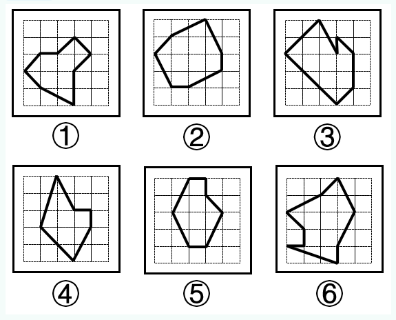

### 1.2 黑白图

> [!TIP]
> 考虑黑白叠加时，黑色将白色盖住

+ 黑块数量相同
  + 位置规律（优先考虑）
    + 移动时考虑**反弹**
  + 黑白间隔块数
+ 黑块数量不同
  + 黑白运算
  + 黑/白周长、面积
  + 黑/白对称性
  + 黑/白一笔画
  + 黑白堆数运算
  + 黑/白堆对称轴与黑/白堆交点数
  + 黑/白连成一个整体

#### 1.2.1 蜂巢

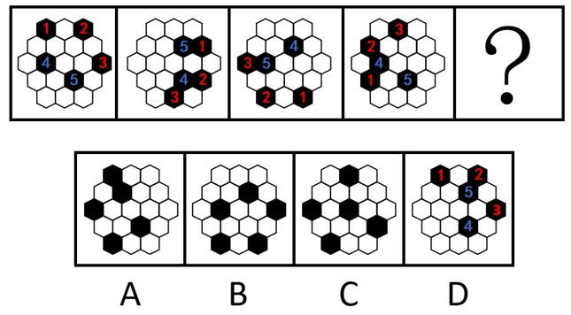

#### 1.2.2 蜂巢圆阵

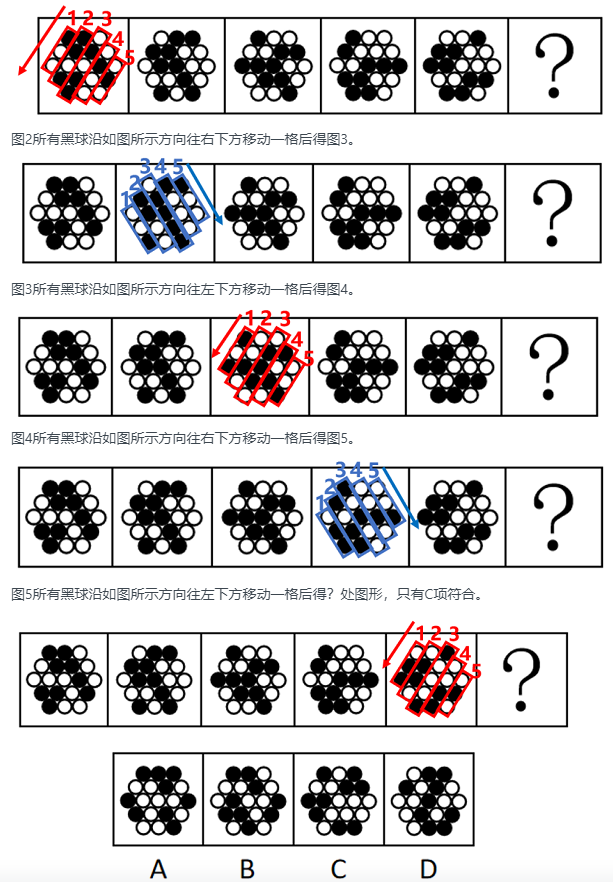
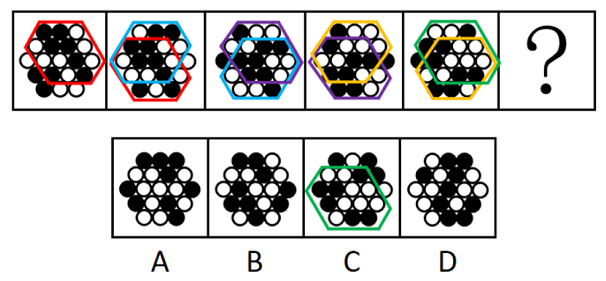

### 1.3 复杂折线图

+ 笔画数

### 1.4 特殊元素

#### 1.4.1 圆

+ 笔画数
+ 切点
+ 曲线数
+ 位置关系（多个圆）
+ 圆内面数量

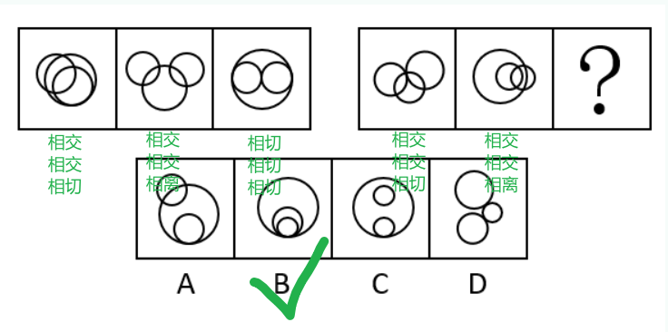

#### 1.4.2 字母

+ 曲线数
+ 面数
+ 开口方向

#### 1.4.3 汉字

+ 横/竖线数
+ 封闭面数
+ 笔画数
+ 首笔画
+ 结构
+ 偏旁
+ 相同元素
+ 拆解为单字
+ 特殊考法

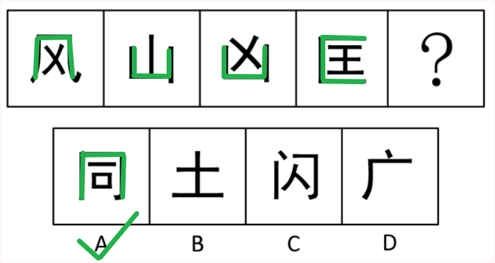

#### 1.4.4 数字

+ 面数
+ 开口方向

#### 1.4.5 其他字符

+ 封闭性

#### 1.4.6 立体图形

+ 顶点数
+ 面数
+ 截面形状
+ 某一视图

#### 1.4.7 七段数码管

+ 旋转
+ 翻转

## 2. 位置规律

### 2.1 移动

+ 方向
  + 直线：上/下/左/右
  + 顺/逆时针
+ 步长
  + 步长固定
  + 步长递增/减

### 2.2 旋转

+ 方向：顺/逆时针
+ 角度

---

时针法

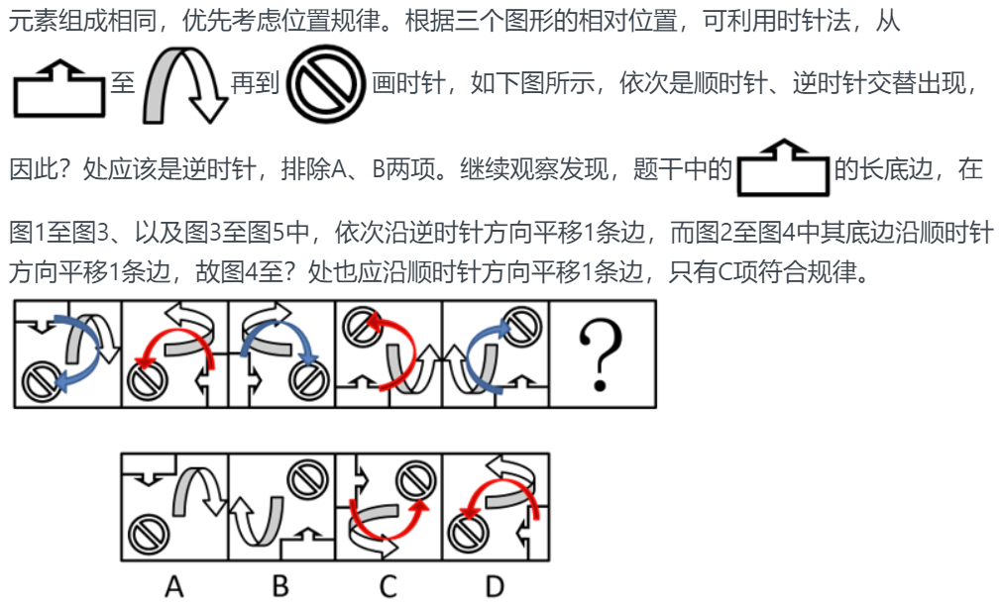

---

### 2.3 翻转

+ 以横轴进行上下翻转，以纵轴进行左右翻转
+ 翻转之后再旋转

### 2.4 互换

### 2.5 相邻比较

+ 相邻保持不变的位置、数目
+ 相邻对折

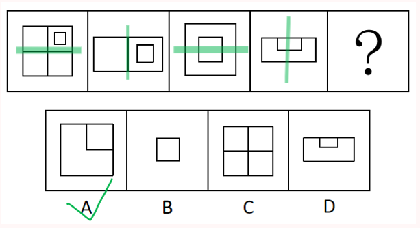

+ 相邻互补

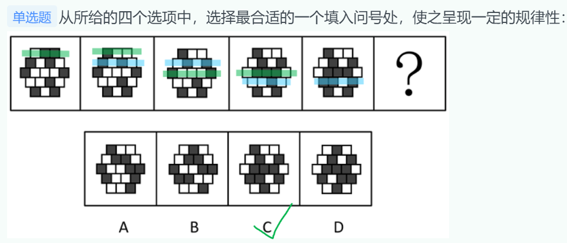

## 3. 样式规律

> [!TIP]
> 结合其他考法，例如旋转+样式规律

### 3.1 黑白运算

> [!NOTE]
> 1. 适用情况：黑块数量不同（偶有空白）
> 2. 虚实运算[例](#solid_dashed)

+ 黑 + 黑 = 黑/白/空
+ 黑 + 白 = 黑/白/空
+ 白 + 白 = 黑/白/空
+ 白 + 黑 = 黑/白/空

---

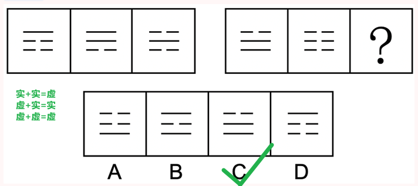

---

### 3.2 加减同异

### 3.3 遍历

+ 元素遍历（均出现某特定元素）
+ 样式遍历
+ 位置遍历

## 4. 属性规律

### 4.1 对称性

+ 对称类型
  + 轴对称：“等腰”元素
  + 中心对称
    + “S”、“N”、“Z”等及其变形
    + 相同图形反放
  + 轴对称+中心对称
+ 对称轴
  + 方向
  + 数量
  + 穿过的点
    + 交点
  + 穿过的边
    + 数量
    + 垂直于对称轴
  + 穿过的面
  + 组成整体的部分的对称轴之间关系（平行、垂直等）

### 4.2 曲直性

+ 曲：图形只由曲线构成
+ 直：图形只由直线构成
+ 曲+直：图形由曲线和直线共同构成

### 4.3 开闭性

+ 开放图形
+ 封闭图形
+ 半开半闭图形：既包含封闭空间又包含开放区域

## 5. 数量规律

### 5.1 堆/部分

> [!NOTE]
> 1. 生活化图形
>     + 部分数
>     + 封闭面数
>     + 开闭性
> 2. 部分数指图中不连通的独立部分数量

+ 堆内元素数量
+ 相同部分数

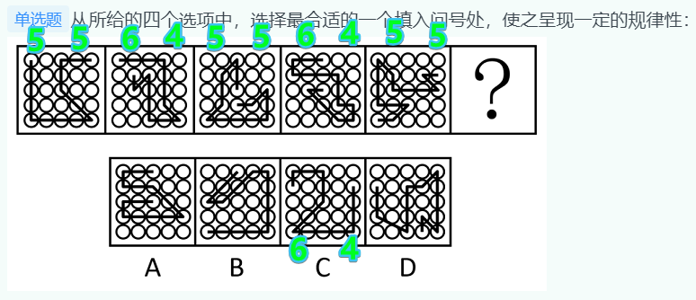

### 5.2 素

+ 元素个数
  + 运算（加减乘除）[例](#elem_num)
  + 相同元素个数
+ 元素种数运算（加减乘除）

---

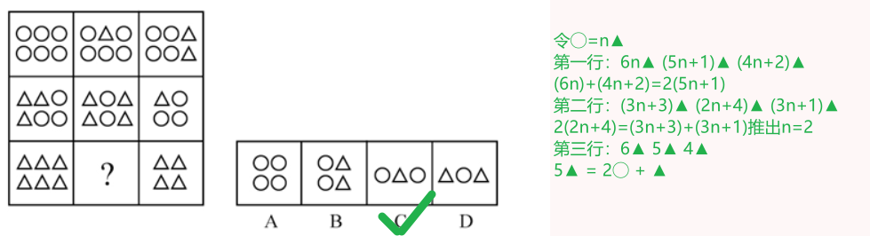

---

### 5.3 点

+ 交点
  + 曲/直交点
    + 曲直交点
    + 曲曲交点
    + 直直交点
  + 内部直线与外部边框的交点数
  + 内部直线之间交点数
  + 切点
  + 对称轴与图形的交点数
  + 其他非数量考法
    + 交点位置[例](#intersection_location)

> [!IMPORTANT]
> 不考虑端点

---

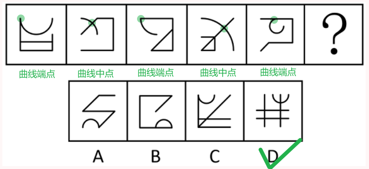

---

### 5.4 线

+ 直/曲线数运算
+ 横/竖线数运算
+ 笔画数
+ 平行线
+ 外/内框线
+ 公共边[例](#public_edge)
+ 其他非数量考法
  + 首尾两端线条性质[例](#line_direction)
  + 外/内框线引出位置[例](#frame_line_position)

---

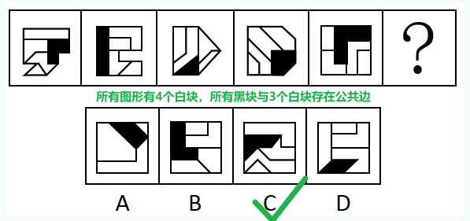

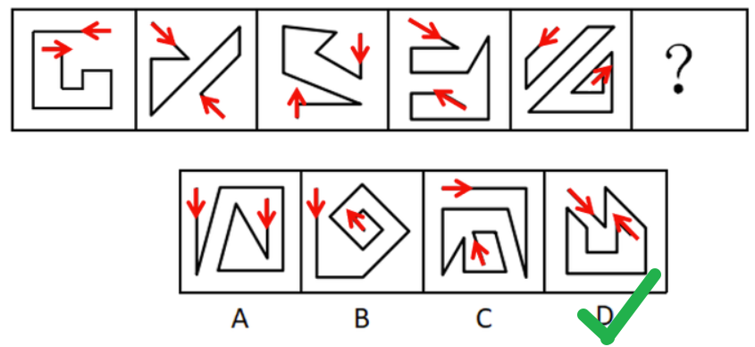

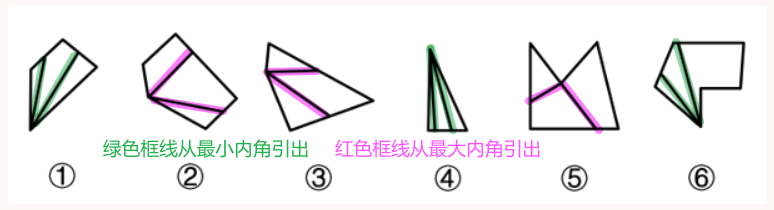

---

> [!NOTE]
> 1. 考笔画数规律的特征图形  
>     + 五角星、月亮、“**日**”、“**田**”等及其变形
>     + 圆**相交、相切**图形
>     + 明显端点图形
> 2. 平行线与笔画数
>     + 图形比较规整的时候，考虑平行线
>     + 图形不规整的时候，考虑笔画数

### 5.5 角

+ 直角数
  + 内部直角
  + 外框直角

### 5.6 面

> 适用情况：封闭面明显

+ 面数量
+ 面种类
  + 全曲线面
  + 全直线面
  + 曲线面+直线面
+ 特殊面（如三角形）
+ 相同面
+ 最大（小）面[例](#same_surface)
  + 最大（小）面与图形外轮廓形状是否相同
  + 最大面与最小面形状相同
  + 最大（小）面的属性
    + 对称性
  + 最大（小）面的面积

> [!NOTE]
> 1. 最大（小）面：**面积**最大（小）的面
> 2. 择优：所有封闭面的面积关系[例](#select_best)

---

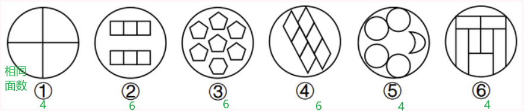

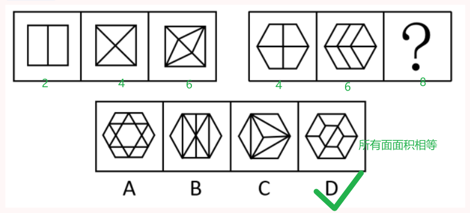

---

### 5.7 综合

+ 封闭面数与对称轴数关系
+ 面数与外框边数
+ 内部交点数与外框边数

---

数量规律的交替性

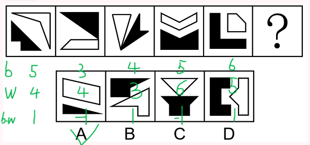

---

## 6. 特殊规律

### 6.1 图形间关系

+ 位置关系
  + 相离（面）
  + 相交
    + 相交于点（线、面）
        + 相交点的位置[例](#intersection_point)
    + 相交于线（面）
        + 公共边的数量
        + 公共边的属性
          + 曲/直
          + 长/短[例](#public_edge_attr)
    + 相交于面（面）
        + 公共面的形状
        + 公共面的面积
  + 相切
  + 相压：两个图形上下覆盖，被压图形有部分线条被覆盖

---

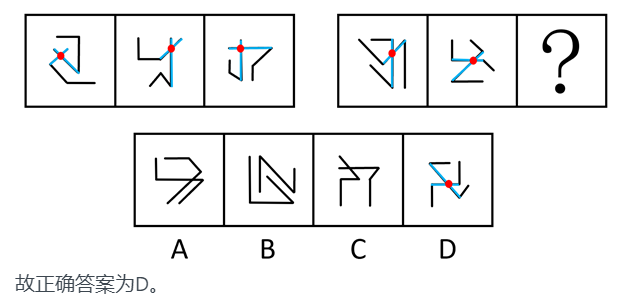

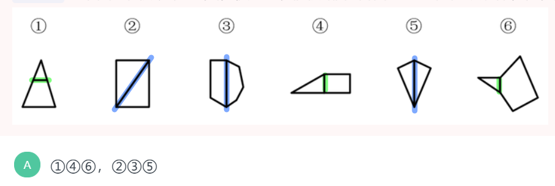

---

### 6.2 功能元素

+ 小黑圆
+ 阴影部分
+ 箭头（方向）